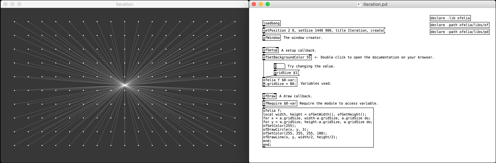

# ofelia

## Description
ofelia is a Pd external which allows you to use openFrameworks and Lua within a real-time [visual programming environment](https://en.wikipedia.org/wiki/Visual_programming_language) for creating [audiovisual](https://en.wikipedia.org/wiki/Audiovisual) artwork or [multimedia](https://en.wikipedia.org/wiki/Multimedia) applications such as games.

[openFrameworks](http://openframeworks.cc/) is an open source C++ toolkit for creative coding. 
[Lua](https://www.lua.org/) is a powerful, efficient, lightweight, easy-to-learn scripting language. 
[Pure Data](https://puredata.info/)(Pd) is a real-time visual programming language for multimedia. 

Thanks to Lua scripting feature, you can do text coding directly on a Pd patch or through a text editor which makes it easier to solve problems that are complicated to express in visual programming languages like Pd. And unlike compiled languages like C/C++, you can see the result immediately as you change code which enables faster workflow. Moreover, you can use openFrameworks functions and classes within a Lua script.

Using ofelia, you can flexibly choose between patching and coding style based on your preference. 
For patching style, ofelia currently provides over [300 abstactions](https://github.com/cuinjune/ofxOfelia/tree/master/ofelia/libs/of) which cover the following features of openFrameworks.

* [ofAppRunner](https://openframeworks.cc/documentation/application/ofAppRunner/): contains functions for getting and setting the properties of the window.
* [ofBaseApp](https://openframeworks.cc/documentation/application/ofBaseApp/): contains callback functions such as setup, update, draw and keyPressed.
* [ofGraphics](https://openframeworks.cc/documentation/graphics/ofGraphics/): has several functions to change the state of the graphics pipeline and to quickly draw 2d shapes.
* [ofImage](https://openframeworks.cc/documentation/graphics/ofImage/): allows to load, save and draw images and do basic transformations on them.
* [ofTrueTypeFont](https://openframeworks.cc/documentation/graphics/ofTrueTypeFont/): can load true type fonts in different formats and draw text using the loaded font.
* [of3dGraphics](https://openframeworks.cc/documentation/3d/of3dGraphics/): contains some functions to quickly draw commonly used 3d shapes like spheres, cones and boxes.
* [of3dUtils](https://openframeworks.cc/documentation/3d/of3dUtils/): allows to draw 3d utililty objects such as arrows, axis and grid.
* [ofMath](https://openframeworks.cc/documentation/math/ofMath/): contains functions for various mathematical operations like calculating distance between two points.
* [ofUtils](https://openframeworks.cc/documentation/utils/ofUtils/): contains different functions for varied purposes, from string manipulation to time functions.
* [ofSystemUtils](https://openframeworks.cc/documentation/utils/ofSystemUtils/): contains functions for creating message, opening files and saving dialogs.

These standard `of` abstractions follow the same function names, arguments and return types as the original openFrameworks API, so users who have used openFrameworks can easily use them on ofelia and transfer from one to another when needed. (If you learn ofelia, you can easily learn openFrameworks and vice versa)

There is only one slight difference in function and class names. For example,

* function: `ofDrawCircle` in openFrameworks becomes `of.drawCircle` in ofelia.
* class: `ofImage` in openFrameworks becomes `of.Image` in ofelia. (notice uppercase `I`)

Help files for the abstractions currently don't exist but you can learn about them from one of the openFrameworks documentation pages above or you can simply [google](https://www.google.com/) the name of the function or class to find the page. (e.g. google `ofDrawCircle` to learn about `of.drawCircle` abstraction in ofelia)

Although some features are not implemented as abstractions yet, you can use them by writing a Lua script on `ofelia define` object. Please see the object [help file](https://github.com/cuinjune/ofxOfelia/blob/master/ofelia/ofelia-object-help.pd) in Pd and read [OF API bindings](https://github.com/danomatika/ofxLua#of-api-bindings) to learn how openFrameworks functions and classes can be used within a Lua script.

The external is available to be used under macOS, Windows, Linux and Raspberry Pi. (64bit only on macOS and Linux)

## Installation
* Make sure you have [Pure Data](https://puredata.info/downloads/pure-data) installed on your desktop.
* Start Pd and go to `Help` -> `Find externals`, then search for `ofelia`
* Select the latest version of ofelia to download and install.
* Try opening patches inside downloaded `ofelia/examples` directory.
* (Windows) If the library fails to load, open `vc_redist` executable file inside `ofelia` directory to install [Microsoft Visual C++ Redistributable packages](https://support.microsoft.com/en-us/help/2977003/the-latest-supported-visual-c-downloads). And if video examples don't work properly, try installing the [K-Lite Codec Pack](https://www.codecguide.com/download_kl.htm).
* (Linux, Raspberry Pi) If the library fails to load, open the Terminal and run the following command to install dependencies.
  <pre>cd ofelia/scripts/distro_name
  sudo ./install_dependencies.sh</pre>
  
## Contributing to ofelia
You can contribute to ofelia by reporting bugs, adding unimplemented [`of` abstractions](https://github.com/cuinjune/ofxOfelia/tree/master/ofelia/libs/of) or by sharing your own custom abstractions such as [`ez` abstractions](https://github.com/cuinjune/ofxOfelia/tree/master/ofelia/libs/ez). Please open an [issue](https://github.com/cuinjune/ofxOfelia/issues) or contact the [author](#author) if you have any questions or suggestions.

--------------

# ofxOfelia

## Description

**ofxOfelia** is ofelia packaged as an openFrameworks addon which enables you to create a standalone application for macOS, Windows, Linux, Raspberry Pi, iOS and Android that can run Pd patches made with ofelia and Pd vanilla objects.

You can share the application with a wide range of audiences including non-Pd users and mobile device users.

## Build Requirements
In order to use ofxOfelia, you first need to download and install openFrameworks. Please follow the [setup guides](http://openframeworks.cc/download/) to download and install openFrameworks. The following tools are used to build ofxOfelia project.

* macOS / iOS: [Xcode](https://developer.apple.com/xcode/).
* Linux / Raspberry Pi: [Makefile](https://www.gnu.org/software/make/).
* Windows: [Visual Studio Community 2017](https://visualstudio.microsoft.com/vs/community/).
* Android: [Android Studio](https://developer.android.com/studio/).

## Setup guide
The setup guide and examples for creating standalone project will be ready soon.

## Developing ofxOfelia
You can help develop ofxOfelia on GitHub: https://github.com/cuinjune/ofxOfelia 
Create an account, clone or fork the repo, then request a push/merge. 
Feel free to contact the [author](#author) if you have any questions or suggestions.

--------------

## Projects that used ofelia/ofxOfelia
* [Chris Niven: BILL JOBS CYBER RADIO](https://www.youtube.com/watch?v=emDiimH0Y7U).
* [Bruno Rohde](http://esmeril.ufba.br/): [ESMERIL](https://youtu.be/MOz3MCIBDzM/).
* [Mike Moreno](https://github.com/MikeMorenoAudio/): [Paths](https://youtu.be/Si_IbyIvPy4/).
* [Martin Hiendl](http://martinhiendl.com/): [Ten Bullets Through One Hole](http://martinhiendl.com/?section=ten-bullets-through-one-hole).
* [Virtual Insight: World of Piano](https://www.worldofpiano.net/).
* [The Center for Haptic Audio Interaction Reseach: Instrument development](https://chair.audio/).
* [POLR Technologies](https://www.facebook.com/polrtech): [LIQUID GRID](https://youtu.be/L5zdNc3NvRg/).

## Acknowledgements
* [Miller Puckette](http://msp.ucsd.edu/) and the [Pd community](http://puredata.info/community/) for developing and maintaining [Pd](http://puredata.info/);
* [Arturo Castro](http://arturocastro.net/), [Theodore Watson](http://www.theowatson.com/) and the [OF community](https://openframeworks.cc/community/) for developing and maintaining [openFrameworks](https://openframeworks.cc/);
* [Daniel Shiffman](https://shiffman.net/) and the [Processing Foundation](https://processingfoundation.org/) for providing many [examples](https://processing.org/examples/) which ofelia copied;
* [Dan Wilcox](http://danomatika.com/) for developing [ofxLua](https://github.com/danomatika/ofxLua), [ofxPd](https://github.com/danomatika/ofxPd) and [ofxMidi](https://github.com/danomatika/ofxMidi) which ofelia/ofxOfelia uses;
* [IOhannes M Zmölnig](https://puredata.info/author/zmoelnig) for developing [GEM](https://puredata.info/downloads/gem) which has greatly influenced ofelia;
* [Henri Menke](https://www.henrimenke.com/) for answering so many questions about integrating Lua into C++;
* Many others who contributed to the development of ofelia.

## Author
Copyright (c) 2018 Zack Lee: <cuinjune@gmail.com> 
GNU General Public License v3.0 
For information on usage and redistribution, and for a DISCLAIMER OF ALL WARRANTIES, see the file, "LICENSE.txt," in this distribution.

