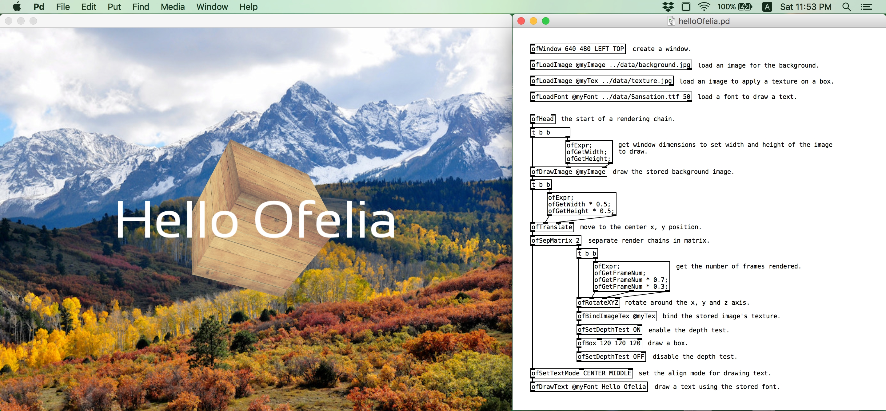
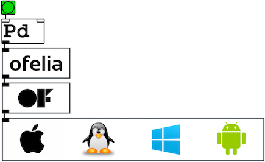

# ofelia

## Description

**ofelia** is a [Pure Data](https://puredata.info/)(aka Pd) external library written with [openFrameworks](http://openframeworks.cc/) for creating cross-platform multimedia applications. 

The library consists of over 400 objects covering most features of [openFrameworks core API](http://openframeworks.cc/documentation/), designed to ease the development of multimedia applications such as visual arts, musical apps and interactive games.

And thanks to the real-time nature of Pure Data, one can make changes and see the result immediately without having to compile.

The library includes the following features:

* interactive output window

* various getters and event listeners

* 2d/3d shapes drawing

* image and font loading

* camera, lighting, material

* framebuffer object

* various data types (vec3f, color..)

* various utilities to speed up development (new expr, counter..)

* bandlimited oscillators and resonant filters

The library is currently available to be used under macOS, Linux(64bit) and Windows. It will also be available on Raspberry Pi soon.

## Installation

* Make sure you have [Pd](https://puredata.info/downloads/pure-data) installed on your desktop.
* Start Pd and go to `Help` -> `Find externals`, then search for `ofelia`
* Select the proper version of ofelia for your system to download and install.
* Try opening any Pd patch inside the downloaded `ofelia` directory to check if the library loads successfully.
* (Linux only) If the library fails to load, open the Terminal and run the following command to install dependencies.
  <pre>cd ofelia/scripts/distro_name
  sudo ./install_dependencies.sh</pre>

## Explore

* Try the example patches inside `ofelia/examples` directory.
* Open `ofelia/help-intro.pd` to see the list of built-in objects in ofelia.
* Open the help files to learn more about each object.
* Create something cool and [share](https://patchstorage.com/) it with other people.
* Feel free to contact the [author](#author) if you have any questions or suggestions.

## Upcoming features

* GLSL shader loader
* Video player
* Video grabber

# ofxOfelia

## Description

**ofxOfelia** is ofelia packaged as an [openFrameworks addon](http://ofxaddons.com/pages/howto#what) which enables you to create a standalone application for macOS, Linux(64bit), Windows(32bit), iOS and Android that can run Pd patches made with ofelia and Pd [vanilla](https://puredata.info/downloads/vanilla) objects.

You can share the application with a wide range of audiences including non-Pd users and mobile device users.

You don't need to write a single line of code to convert your Pd patch into a standalone application so don't be afraid to follow the setup guide below.

## Build Requirements
In order to use ofxOfelia, you first need to download and install openFrameworks 0.9.8 which is the most recent stable release. ofxOfelia is currently not compatible with openFrameworks 0.10.x and it will be updated after the next stable release of openFrameworks. Please follow the [setup guides](http://openframeworks.cc/download/) to download and install openFrameworks 0.9.8. The following tools are used to build ofxOfelia project.

* macOS / iOS : Xcode.
* Linux : Makefile.
* Windows : Visual Studio Community 2015. (or Visaul Studio 2017)
* Android : Android Studio.

## Setup guide

* Make sure you have openFrameworks setup on your desktop.
* Download [ofxOfelia](https://github.com/cuinjune/ofxOfelia/releases/latest), [ofxPd](https://github.com/danomatika/ofxPd/archive/1.6.1.tar.gz), [ofxMidi](https://github.com/danomatika/ofxMidi/archive/1.0.6.tar.gz) and rename the extracted folders to `ofxOfelia`, `ofxPd` and `ofxMidi`. 
Place them within the directory `OF/addons`. ("OF" indicates the base directory of openFrameworks)
* (macOS / Linux / Windows) Download [pd-0.48-1 source archive](http://msp.ucsd.edu/Software/pd-0.48-1.src.tar.gz) and find `src` folder inside the extracted directory and copy it into `OF/addons/ofxOfelia/libs/pd`.
* (macOS / Linux / iOS / Android) Open the Terminal and run the following to update openFrameworks.
  <pre>cd OF/addons/ofxOfelia/scripts/(targetOS)
  sudo ./updateOF.sh</pre>
* (Windows) Execute the following batch file to update openFrameworks.
  <pre>OF/addons/ofxOfelia/scripts/Win/updateOF.bat</pre>

## Running the standalone example

#### macOS
* Open `OF/addons/ofxOfelia/macOSExample/macOSExample.xcodeproj` with Xcode and run the project.

#### Linux
* Open the Terminal and run the following command to run the project.
  <pre>cd OF/addons/ofxOfelia/Linux64Example
  make && make RunRelease</pre>
  
#### Windows
* Open `OF/addons/ofxOfelia/Win32Example/Win32Example.vcxproj` with Visual Studio and run the project.

#### iOS
* Open `OF/addons/ofxOfelia/iOSExample/iOSExample.xcodeproj` with Xcode.
* Connect your iOS device and run the project. (you will need to setup [code signing](https://developer.apple.com/support/code-signing/) to run the app on a device)

#### Android
* Open Android Studio, select `Open an existing Android Studio project` and open `OF/addons/ofxOfelia/AndroidExample`.
* Go to `Build` -> `Generate Signed APK` to [generate a key and keystore](https://developer.android.com/studio/publish/app-signing.html) based on `AndroidExample/keystore.properties`.
* Connect your Android device and run the project.

## Creating your own standalone project

#### macOS
* Copy the folder `OF/addons/ofxOfelia/macOSExample` and paste it into `OF/apps/myApps`.
* Rename the project in Xcode and rename the project folder to your liking.
* Replace Pd patch and data in `yourProject/bin/data/pd` with your files. (main patch should be named `main.pd`)
* Build the project in Xcode. you will find a `.app` file in `yourProject/bin` directory.

#### Linux
* Copy the folder `OF/addons/ofxOfelia/Linux64Example` and paste it into `OF/apps/myApps`.
* Rename the project folder to your liking.
* Replace Pd patch and data in `yourProject/bin/data/pd` with your files. (main patch should be named `main.pd`)
* Build the project with `make`. you will find a Unix executable file in `yourProject/bin` directory.

#### Windows
* Copy the folder `OF/addons/ofxOfelia/Win32Example` and paste it into `OF/apps/myApps`.
* Rename the project in Visual Studio and rename the project folder to your liking.
* Replace Pd patch and data in `yourProject/bin/data/pd` with your files. (main patch should be named `main.pd`)
* Build the project in Visual Studio. you will find a `.exe` file in `yourProject/bin` directory.

#### iOS
* Copy the folder `OF/addons/ofxOfelia/iOSExample` (or `iOSABExample` if you want your app to support [Audiobus](https://audiob.us/)) and paste it into `OF/apps/myApps`.
* Rename the project in Xcode and rename the project folder to your liking.
* Replace Pd patch and data in `yourProject/bin/data/pd` with your files. (main patch should be named `main.pd`)
* Connect your iOS device and run the project in Xcode.

#### Android
* Copy the folder `OF/addons/ofxOfelia/AndroidExample` and paste it into `OF/apps/myApps`.
* Rename the project in Android Studio. (please read `Creating new projects` section from this [link](http://openframeworks.cc/setup/android-studio/))
* Replace Pd patch and data in `yourProject/bin/data/pd` with your files. (main patch should be named `main.pd`)
* If your app uses portrait orientation as default, then change `android:screenOrientation="reverseLandscape"` to `android:screenOrientation="portrait"` in AndroidManifest.xml file. 
* Connect your Android device and run the project in Android Studio.

## Developing ofxOfelia
You can help developing ofxOfelia on GitHub: https://github.com/cuinjune/ofxOfelia 
Create an account, clone or fork the repo, then request a push/merge. 
If you find any bugs or suggestions please log them to GitHub as well.

## Author
Copyright (c) 2018 Zack Lee: <cuinjune@gmail.com> 
GNU General Public License v3.0 
For information on usage and redistribution, and for a DISCLAIMER OF ALL WARRANTIES, see the file, "LICENSE.txt," in this distribution.

