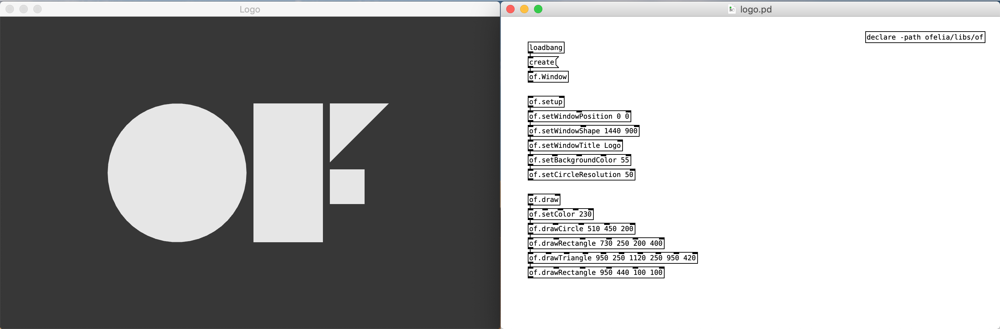
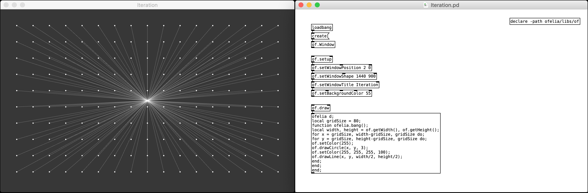

# ofelia

## Description
**ofelia** is an external library which allows you to use openFrameworks and Lua within Pure Data to create cross-platform multimedia applications.

[openFrameworks](http://openframeworks.cc/) is an open source C++ toolkit for creative coding. 
[Lua](https://www.lua.org/) is a powerful, efficient, lightweight, embeddable scripting language. 
[Pure Data](https://puredata.info/)(aka Pd) is a real-time visual programming language for multimedia. 

ofelia currently provides over 300 abstactions which cover the following features of openFrameworks.

* [ofAppRunner](https://openframeworks.cc/documentation/application/ofAppRunner/): contains functions for getting and setting the properties of the window.
* [ofBaseApp](https://openframeworks.cc/documentation/application/ofBaseApp/): contains callback functions such as setup, update, draw and keyPressed.
* [ofGraphics](https://openframeworks.cc/documentation/graphics/ofGraphics/): has several functions to change the state of the graphics pipeline and allows to quickly draw 2d shapes.
* [ofImage](https://openframeworks.cc/documentation/graphics/ofImage/): allows to load, save and draw images and do basic transformations on them.
* [ofTrueTypeFont](https://openframeworks.cc/documentation/graphics/ofTrueTypeFont/): can load true type fonts in different formats and draw text using the loaded font.
* [of3dGraphics](https://openframeworks.cc/documentation/3d/of3dGraphics/): contains some functions to quickly draw the most used 3d shapes like spheres, cones and boxes.
* [of3dUtils](https://openframeworks.cc/documentation/3d/of3dUtils/): allows to draw 3d utililty objects such as arrows, axis and grid.
* [ofMath](https://openframeworks.cc/documentation/math/ofMath/): contains functions for various mathematical operations like calculating the distance between two points.
* [ofUtils](https://openframeworks.cc/documentation/utils/ofUtils/): contains different functions for varied purposes, from string manipulation to time functions.
* [ofSystemUtils](https://openframeworks.cc/documentation/utils/ofSystemUtils/): contains functions for creating message and file opening and saving dialogs.

Although more abstractions will be added later, you can already use all features of openFrameworks using [ofelia] object which allows you to code Lua on a Pd patch or create such abstractions yourself.

The library is available to be used under macOS, Windows, Linux and Raspberry Pi.

## Installation
* Make sure you have [Pure Data](https://puredata.info/downloads/pure-data) installed on your desktop.
* Start Pd and go to `Help` -> `Find externals`, then search for `ofelia`
* Select the proper version of ofelia for your system to download and install.
* Try opening patches inside the downloaded `ofelia/examples` directory.
* (Windows) If the library fails to load, open `vc_redist` executable file inside `ofelia` directory to install [Microsoft Visual C++ Redistributable packages](https://support.microsoft.com/en-us/help/2977003/the-latest-supported-visual-c-downloads).
* (Linux, Raspberry Pi) If the library fails to load, open the Terminal and run the following command to install dependencies.
  <pre>cd ofelia/scripts/distro_name
  sudo ./install_dependencies.sh</pre>
  
# ofxOfelia

## Description

**ofxOfelia** is ofelia packaged as an openFrameworks addon which enables you to create a standalone application for macOS, Windows, Linux, Raspberry Pi, iOS and Android that can run Pd patches made with ofelia and Pd vanilla objects.

You can share the application with a wide range of audiences including non-Pd users and mobile device users.

## Build Requirements
In order to use ofxOfelia, you first need to download and install openFrameworks. Please follow the [setup guides](http://openframeworks.cc/download/) to download and install openFrameworks. The following tools are used to build ofxOfelia project.

* macOS / iOS : Xcode.
* Linux / Raspberry Pi : Makefile.
* Windows : Visual Studio Community 2017.
* Android : Android Studio.

## Setup guide
The setup guide and examples for creating standalone project will be ready soon.

## Developing ofxOfelia
You can help developing ofxOfelia on GitHub: https://github.com/cuinjune/ofxOfelia 
Create an account, clone or fork the repo, then request a push/merge. 
If you find any bugs or suggestions please log them to GitHub as well.

## Author
Copyright (c) 2018 Zack Lee: <cuinjune@gmail.com> 
GNU General Public License v3.0 
For information on usage and redistribution, and for a DISCLAIMER OF ALL WARRANTIES, see the file, "LICENSE.txt," in this distribution.

